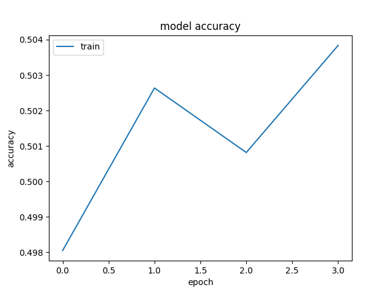
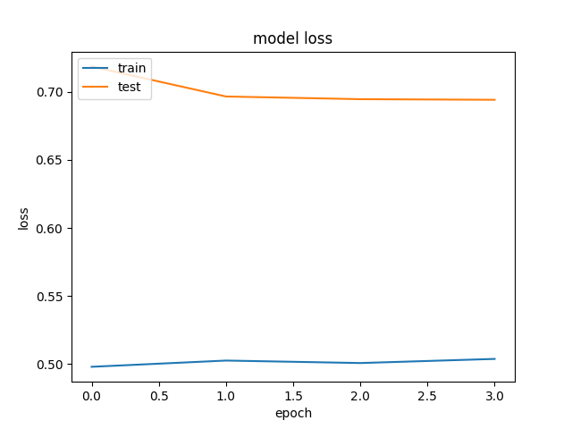

# Montreal Car Accident Risk Modeling

Our aim is to produce the best real-time, practical risk model for car accidents in Montreal.

## Environment

You will need,

 - Python >=3.6

 - PostgreSQL >=12.0

 - PostGIS >=3.0

## Dependencies

We suggest working out of a virtual environment

    mkdir venv

    python3 -m venv ./venv/

    source venv/bin/activate

Then installing the dependencies using pip,

    pip3 install -r requirements.txt

## Datatabase

We use PostgreSQL with the [PostGIS extension](https://postgis.net/).

To setup the PostGIS extension on AWS RDS, here is the [article](https://docs.aws.amazon.com/AmazonRDS/latest/UserGuide/Appendix.PostgreSQL.CommonDBATasks.html#Appendix.PostgreSQL.CommonDBATasks.PostGIS)

### Data Model

**Accidents**

    CREATE TABLE accidents (
        index INT GENERATED ALWAYS AS IDENTITY,
        accident_id VARCHAR(64) NOT NULL UNIQUE,
        datetime TIMESTAMP NOT NULL,
        geometry geometry(POINT,32188) NOT NULL,
        road_segment_id INT,
        weather_data JSONB,
        PRIMARY KEY(index),
        FOREIGN KEY (road_segment_id) REFERENCES road_segments (road_segment_id)
    )

**Road Segments**

    CREATE TABLE road_segments (
        index INT GENERATED ALWAYS AS IDENTITY,
        road_segment_id INT NOT NULL UNIQUE,
        class INT,
        direction INT,
        geometry geometry(LINESTRING,32188) NOT NULL,
        PRIMARY KEY(index)
    )

**Weather Stations**

    CREATE TABLE weather_stations (
        index INT GENERATED ALWAYS AS IDENTITY,
        weather_station_id VARCHAR(32) NOT NULL UNIQUE,
        geometry geometry(POINT,32188) NOT NULL,
        PRIMARY KEY(index)
    )

**Weather Records**

    CREATE TABLE weather_records (
        index BIGINT GENERATED BY DEFAULT AS IDENTITY,
        weather_station_id VARCHAR(32) NOT NULL,
        datetime TIMESTAMP NOT NULL,
        temperature FLOAT8,
        dewpoint FLOAT8,
        humidity FLOAT8,
        wdirection FLOAT8,
        wspeed FLOAT8,
        visibility FLOAT8,
        pressure FLOAT8,
        risky FLOAT8,
        PRIMARY KEY(index),
        FOREIGN KEY (weather_station_id) REFERENCES weather_stations (weather_station_id)
    )

## Satellite Images

We use,

    https://developers.google.com/earth-engine/datasets/catalog/COPERNICUS_S2_SR

## Data Features for training

With our source data we consolidate a dataset with the following features,

    - temperature
    - dewpoint
    - humidity
    - wdirection
    - wspeed
    - visibility
    - pressure

    - sun_elevation
    - sun_zenith
    - sun_azimuth

## Contributors

* **Jean-Felix Brouillette** - *Project Lead* - [jfbrou](https://github.com/jfbrou)

* **Jean-Romain Roy** - *GIS & Vision Consultant* - [jeanromainroy](https://github.com/jeanromainroy)
